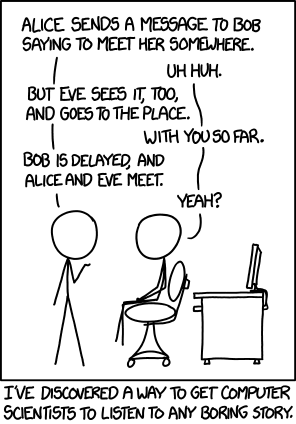

# Communications example

# Alice

Alice is sending a message to Bob.

## Sender
* Alice sends to Bob

### Sub heading level 3

The message is the The Quick Brown Fox Jumps Over the Lazy Dog's Back!
